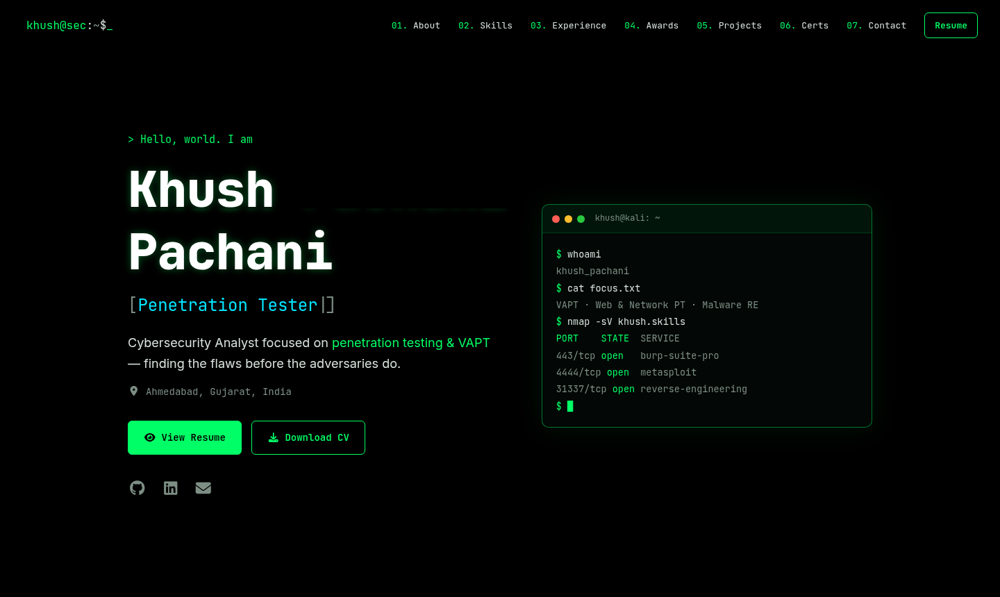

<div align="center">

# `khush@sec:~$` Khush Pachani

### Cybersecurity Analyst — Penetration Testing & VAPT

*Finding the flaws before the adversaries do.*

[](https://suid0.in)
[](https://www.linkedin.com/in/khush-pachani-7128a5248/)
[](mailto:khush.b.pachani@gmail.com)
[](https://github.com/Khushpachani)
[](https://tryhackme.com/p/Ultra.instinct)

[](https://github.com/Khushpachani/khushpachani.github.io/actions/workflows/deploy.yml)

<a href="https://suid0.in"></a>

</div>

---

## 🛡️ About

Offensive security researcher and penetration tester specializing in **web application, network, and OT/ICS** penetration testing following **PTES** and **OWASP** standards — from finding RCE, auth bypass and SSTI in production systems serving **100,000+ users**, to reverse-engineering real-world malware like **njRAT**.

| | |
|---|---|
| 🏆 | **2nd Runner-Up** — Adani Innovation Mindstorm OT Cybersecurity Hackathon 2026 |
| 🎓 | **M.Sc. Cyber Security & Digital Forensics** — Rashtriya Raksha University |
| 📜 | **CNSP · CSEDP · IBM Malware Analysis · ISO/IEC 27001 & 42001 Lead Auditor** |
| 🌐 | **Live:** [suid0.in](https://suid0.in) · also [khushpachani.github.io](https://khushpachani.github.io) |

---

## ✨ Features

- 🖤 **Black terminal theme** — neon-green accents, monospace type, `~/section` headings
- 🌧️ **Matrix-rain background** and CRT scanlines (turned off automatically for *reduce motion*)
- ⌨️ **Typing role animation**, glitch-effect name, and a live-looking `whoami` / `nmap` terminal
- 🔴 **Severity-tagged findings** (critical / high / medium) on VAPT projects
- ✅ **Verify links** on every certification
- 📱 **Responsive** — slide-out menu and single-column layout on mobile
- 📝 **All content in one file** — no need to touch components to update text
- 🚀 **Auto-deploy** — every push to `main` builds and publishes via GitHub Actions

---

## 🧱 Tech Stack


---

## 📂 Project Structure

```text
khush-portfolio/
├── .github/workflows/deploy.yml   # build + publish to gh-pages on push
├── public/
│   ├── CNAME                      # custom domain: suid0.in
│   └── index.html                 # title, SEO & link-preview tags, fonts
├── src/
│   ├── data/portfolio.ts          # ⭐ ALL website content lives here
│   ├── components/
│   │   ├── Main.tsx               # hero: name, typing roles, terminal
│   │   ├── About.tsx              # 01 · summary + stats
│   │   ├── Expertise.tsx          # 02 · skills
│   │   ├── Timeline.tsx           # 03 · experience
│   │   ├── Achievements.tsx       # 04 · awards
│   │   ├── Project.tsx            # 05 · projects
│   │   ├── Certifications.tsx     # 06 · certs · 07 · education
│   │   ├── Footer.tsx             # 08 · contact
│   │   ├── Navigation.tsx
│   │   ├── Section.tsx            # section heading + fade-in
│   │   └── MatrixRain.tsx         # background animation
│   ├── App.tsx
│   └── index.scss                 # all styles (theme colours at the top)
└── docs/preview.png               # README screenshot
```

---

## ✏️ Updating Content

Everything shown on the site — profile, skills, experience, achievements, projects,
certifications, education and the resume link — lives in
**[`src/data/portfolio.ts`](src/data/portfolio.ts)**.

```bash
# 1. edit src/data/portfolio.ts
# 2. publish
git add -A
git commit -m "Update portfolio content"
git push origin main        # site updates in ~1–2 minutes
```

**Change the resume:** replace `RESUME_ID` at the top of `portfolio.ts` with the ID from
`https://drive.google.com/file/d/<ID>/view`.

**Change the colours:** edit the CSS variables at the top of `src/index.scss`
(`--accent`, `--bg`, `--cyan`, …).

---

## 💻 Run Locally

> Optional — needs **Node.js 18+**. Deploys do not require Node on your machine.

```bash
npm install
npm start          # dev server → http://localhost:3000
npm test           # run tests
npm run build      # production build → ./build
```

---

## 🚀 Deployment

```text
push to main ──▶ GitHub Actions ──▶ npm ci + npm run build ──▶ gh-pages branch ──▶ https://suid0.in
```

| Setting | Value |
|---|---|
| Settings → Pages → Source | Deploy from a branch · `gh-pages` / `(root)` |
| Settings → Pages → Custom domain | `suid0.in` · Enforce HTTPS ✅ |
| Settings → Actions → Workflow permissions | Read and write |
| DNS (GoDaddy) | `A @` → `185.199.108–111.153` · `CNAME www` → `khushpachani.github.io` |

---

<div align="center">

```text
$ ./establish_connection.sh
Open to full-time Penetration Testing / VAPT roles and security research collaborations.
```

**[suid0.in](https://suid0.in)** · **[LinkedIn](https://www.linkedin.com/in/khush-pachani-7128a5248/)** · **[TryHackMe](https://tryhackme.com/p/Ultra.instinct)** · **[Email](mailto:khush.b.pachani@gmail.com)**

<sub>/* stay curious, stay ethical */ · Licensed under MIT</sub>

</div>
